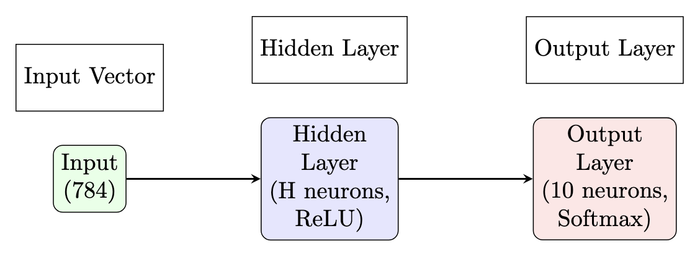
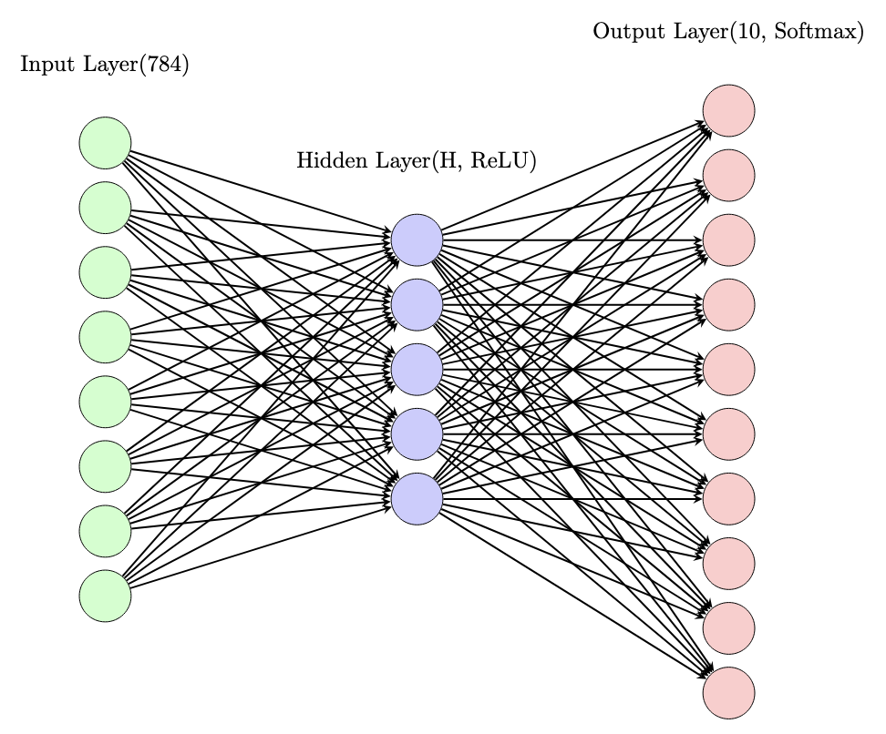
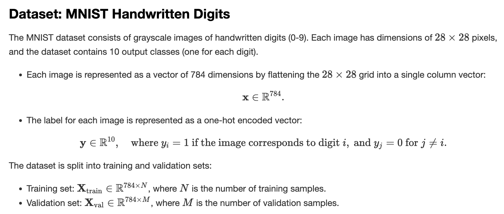
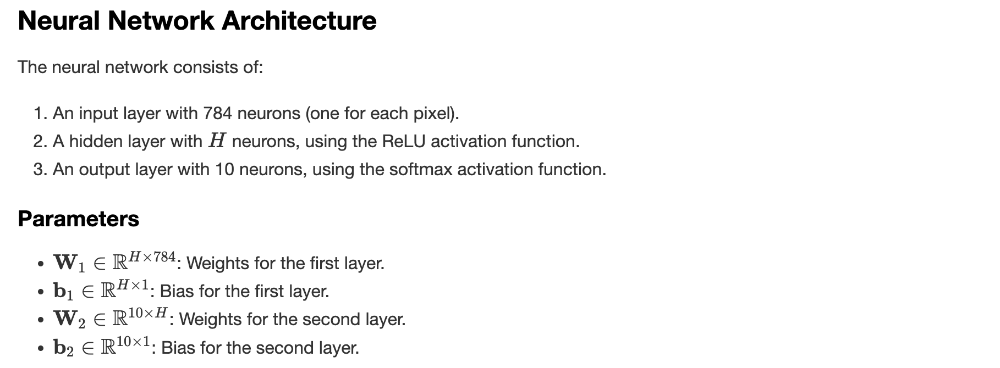
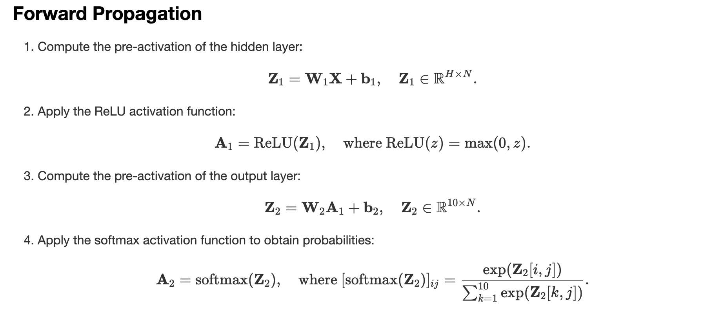
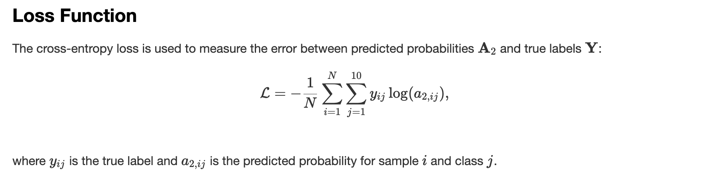
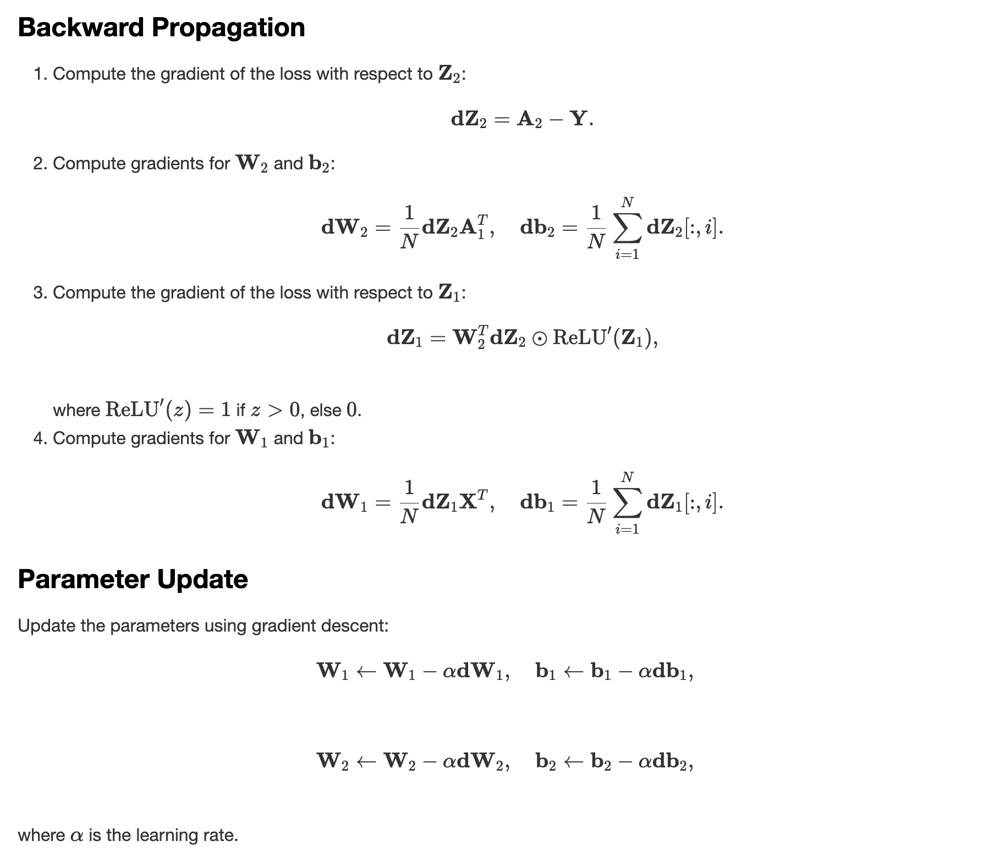

# Training a Neural Network from Scratch using C++ and CUDA

Girish Krishnan | [LinkedIn](https://www.linkedin.com/in/girk/) | [GitHub](https://github.com/Girish-Krishnan)

___




This project is a **GPU-accelerated** C++ implementation of a Neural Network from scratch, using **CUDA** for parallelizing the training process. The network is trained on the MNIST dataset for handwritten digit classification. 

This project is an extension of the work done in [my previous repository](https://github.com/Girish-Krishnan/Multithreading-CPP-NeuralNet), which demonstrated multithreading and CPU-based parallelization. Here, we've taken it a step further by leveraging CUDA to parallelize computations on the GPU for even faster training.

---

## Mathematical Background







---

## Implementation Details

This repository contains a single file, **`neural_network.cu`**, which implements a simple neural network with one hidden layer for classifying MNIST digits. The CUDA kernels handle both the forward and backward passes in parallel, allowing efficient training on the GPU.

1. **Forward Pass**: 
   - Computes the linear transformation (\(Z_1\), \(Z_2\)) and non-linear activation (ReLU, softmax).
   - Parallelized such that each thread processes one training example.

2. **Backward Pass**:
   - Computes gradients for each parameter and applies gradient descent.
   - Parallelized similarly, with each thread handling gradients for one training example.

---

## Command-Line Arguments

Below is the list of supported arguments:

| Argument           | Default Value       | Description                                                                 |
|--------------------|---------------------|-----------------------------------------------------------------------------|
| `--train_file`     | `data/train.csv`    | Path to the training dataset in CSV format.                                 |
| `--learning_rate`  | `0.1`               | Learning rate for gradient descent.                                         |
| `--iterations`     | `40`                | Number of iterations to train the model.                                    |
| `--train_ratio`    | `0.8`               | Ratio of the dataset to use for training. The rest is used for validation.  |
| `--hidden_size`    | `10`                | Number of neurons in the hidden layer.                                      |

---

## Compilation Instructions

To compile the CUDA implementation, ensure that you have the [NVIDIA CUDA Toolkit](https://developer.nvidia.com/cuda-toolkit) installed, and run:

```bash
$ nvcc -o neural_network neural_network.cu
```

---

## Running the Code

Below is an example of how to run the GPU-accelerated neural network:

```bash
$ ./neural_network --train_file ./data/train.csv --learning_rate 0.1 --iterations 1000 --train_ratio 0.8 --hidden_size 10
```

Below is an example of the output generated by running the program.

```plaintext
Iteration: 0, Training Accuracy: 0.128036, Validation Accuracy: 0.139286
Iteration: 20, Training Accuracy: 0.381399, Validation Accuracy: 0.384643
Iteration: 40, Training Accuracy: 0.511161, Validation Accuracy: 0.50631
Iteration: 60, Training Accuracy: 0.580685, Validation Accuracy: 0.579405
Iteration: 80, Training Accuracy: 0.63006, Validation Accuracy: 0.632738
Iteration: 100, Training Accuracy: 0.667381, Validation Accuracy: 0.668095
Iteration: 120, Training Accuracy: 0.696905, Validation Accuracy: 0.694881
Iteration: 140, Training Accuracy: 0.719494, Validation Accuracy: 0.719524
Iteration: 160, Training Accuracy: 0.738899, Validation Accuracy: 0.734405
Iteration: 180, Training Accuracy: 0.752887, Validation Accuracy: 0.750952
Iteration: 200, Training Accuracy: 0.764048, Validation Accuracy: 0.762262
Iteration: 220, Training Accuracy: 0.774821, Validation Accuracy: 0.770952
Iteration: 240, Training Accuracy: 0.783423, Validation Accuracy: 0.779167
Iteration: 260, Training Accuracy: 0.791339, Validation Accuracy: 0.786548
Iteration: 280, Training Accuracy: 0.798423, Validation Accuracy: 0.794048
Iteration: 300, Training Accuracy: 0.804881, Validation Accuracy: 0.79881
Iteration: 320, Training Accuracy: 0.811667, Validation Accuracy: 0.804643
Iteration: 340, Training Accuracy: 0.816369, Validation Accuracy: 0.808095
Iteration: 360, Training Accuracy: 0.82125, Validation Accuracy: 0.812738
Iteration: 380, Training Accuracy: 0.825, Validation Accuracy: 0.817738
Iteration: 400, Training Accuracy: 0.829315, Validation Accuracy: 0.820238
Iteration: 420, Training Accuracy: 0.833006, Validation Accuracy: 0.82381
Iteration: 440, Training Accuracy: 0.836399, Validation Accuracy: 0.82619
Iteration: 460, Training Accuracy: 0.839048, Validation Accuracy: 0.829048
Iteration: 480, Training Accuracy: 0.841488, Validation Accuracy: 0.831786
Iteration: 500, Training Accuracy: 0.843631, Validation Accuracy: 0.835119
Iteration: 520, Training Accuracy: 0.845685, Validation Accuracy: 0.836548
Iteration: 540, Training Accuracy: 0.8475, Validation Accuracy: 0.838333
Iteration: 560, Training Accuracy: 0.849375, Validation Accuracy: 0.841071
Iteration: 580, Training Accuracy: 0.851399, Validation Accuracy: 0.843452
Iteration: 600, Training Accuracy: 0.853244, Validation Accuracy: 0.845595
Iteration: 620, Training Accuracy: 0.855357, Validation Accuracy: 0.847262
Iteration: 640, Training Accuracy: 0.857024, Validation Accuracy: 0.849405
Iteration: 660, Training Accuracy: 0.858661, Validation Accuracy: 0.850595
Iteration: 680, Training Accuracy: 0.860685, Validation Accuracy: 0.852619
Iteration: 700, Training Accuracy: 0.862113, Validation Accuracy: 0.853214
Iteration: 720, Training Accuracy: 0.863631, Validation Accuracy: 0.854762
Iteration: 740, Training Accuracy: 0.865208, Validation Accuracy: 0.85631
Iteration: 760, Training Accuracy: 0.86625, Validation Accuracy: 0.857619
Iteration: 780, Training Accuracy: 0.867202, Validation Accuracy: 0.857976
Iteration: 800, Training Accuracy: 0.868333, Validation Accuracy: 0.859167
Iteration: 820, Training Accuracy: 0.869375, Validation Accuracy: 0.859524
Iteration: 840, Training Accuracy: 0.870327, Validation Accuracy: 0.860833
Iteration: 860, Training Accuracy: 0.871339, Validation Accuracy: 0.862262
Iteration: 880, Training Accuracy: 0.87253, Validation Accuracy: 0.863095
Iteration: 900, Training Accuracy: 0.873393, Validation Accuracy: 0.86381
Iteration: 920, Training Accuracy: 0.874643, Validation Accuracy: 0.864524
Iteration: 940, Training Accuracy: 0.875804, Validation Accuracy: 0.866071
Iteration: 960, Training Accuracy: 0.876964, Validation Accuracy: 0.866429
Iteration: 980, Training Accuracy: 0.87753, Validation Accuracy: 0.867976
Iteration: 999, Training Accuracy: 0.878125, Validation Accuracy: 0.867857
Training complete!
```

---

## License

This project is licensed under the MIT License - see the [LICENSE](LICENSE) file for details.